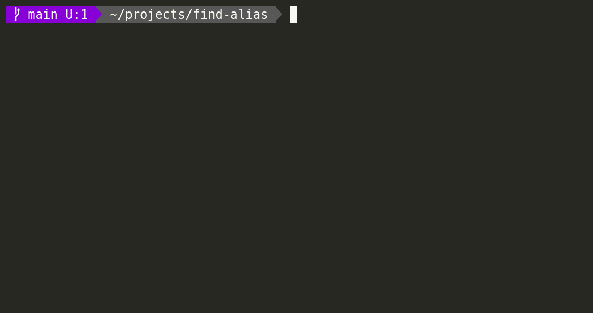

# FIND ALIAS

**Find-alias** is an interactive alias finder and executor, it helps you to quickly find and execute any aliases.

## Installation

1. `git clone https://github.com/blzsaa/find-alias.git`
1. `cd find-alias`
1. `npm ci`
1. `npm install -g .`
1. `fa`
1. `restart the terminal`

## Features

- run the program by typing `fa`
- to find and run an alias:
  - write in any keyword in the quick filter
  - use up and down button to choose any of the aliases from the filtered list
  - press \<enter> to run chosen alias
- to find and add extra arguments before running an alias:
  - write in any keyword in the quick filter
  - use up and down button to choose from the filtered list
  - press \<tab>
  - write in the extra arguments
  - press \<enter> to run

## Why did I create this software?

- Have you ever felt lost in dozens and dozens (or even hundreds) of different aliases?
- After installing [Oh My Bash](https://github.com/ohmybash/oh-my-bash) or
  [Oh My Zsh](https://github.com/ohmyzsh/ohmyzsh) and adding a few plugins you could simply end up in a with 100+ new
  aliases, without any easily accessible documentation.
- It happened too many times to me that I knew that an alias exist for my problem, but it requires too much time and
  effort to find it, so in the end I just ended up typing in the long command.
  - What is the alias for adding all the files to git and amending previous commit without any edit?
  - Or what is the alias if I want to edit the commit message?
  - Or what is the alias if I only want to add a few files?
- The aim of the program is to give a helper utility where you can find any alias quickly, e.g. the above-mentioned
  aliases could be easily found by searching keywords `commit` and `amend` and then you can choose which ever you need
  at the moment.

## Uninstalling

1. `npm uninstall -g find-alias`
1. remove `~/.find-alias.sh` file from your home directory
1. remove `#find-alias` part from your `.bashrc` or `.zshrc` file

## Contributing

Pull requests are welcome. For major changes, please open an issue first to discuss what you would like to change.

Please make sure to update tests as appropriate.

## License

[MIT](https://choosealicense.com/licenses/mit/)
